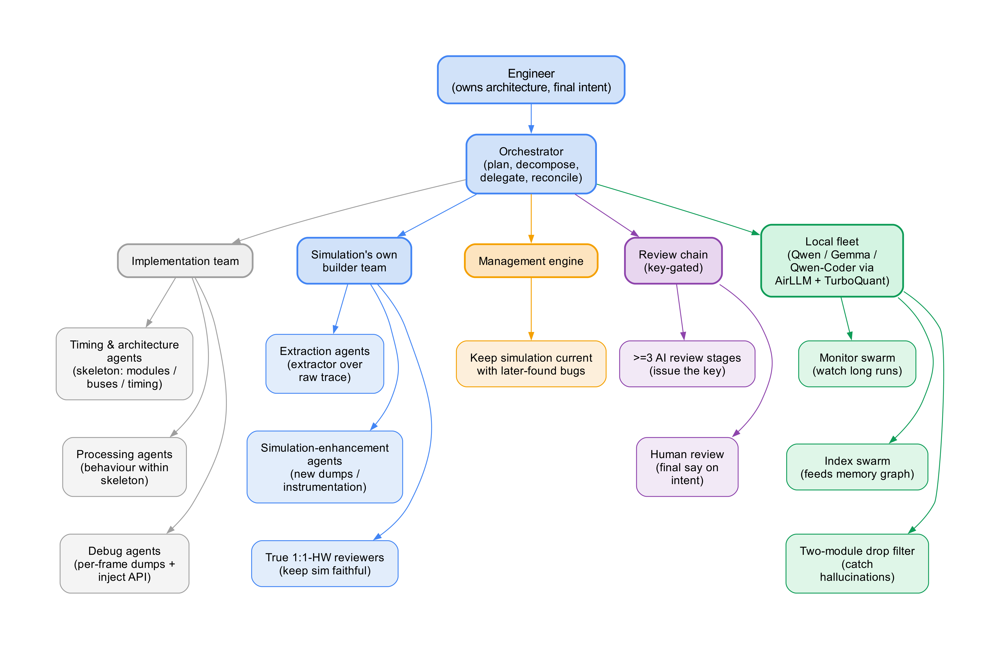
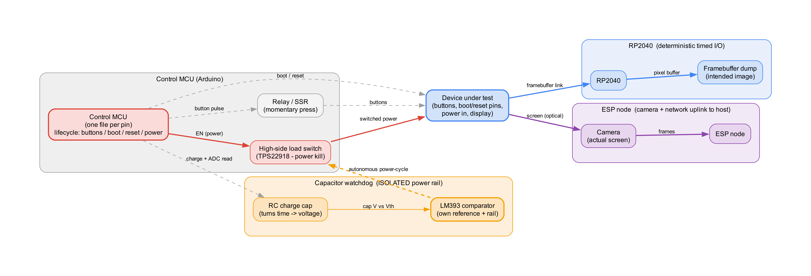
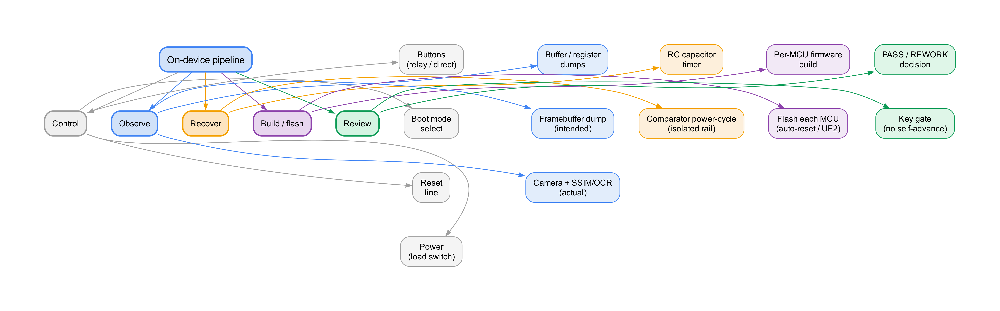

# Simulation-Driven Development

### Building Hardware with AI Agents Against a One-to-One, No-Mocks Simulation

**[Read the full paper (PDF)](./simulation_driven_development.pdf)**

---

## What is this?

When AI agents write large parts of an embedded or hardware system, the one
thing that used to make the work tractable disappears: a single engineer
holding the complete model of the system in their head. **Simulation-driven
development** is a methodology that relocates that model out of the engineer's
head and into a software simulation that reproduces the target hardware's
interfaces and behaviour *one-to-one, with no mocks* — then lets a gated,
multi-layer agent pipeline build, test, and repair against it.

The method rests on four ideas:

1. **Handoffs are lossy.** Every model-to-model handoff compresses the shared
   context, exactly as in human communication. The pipeline is built to
   minimize and contain that loss.
2. **No mocks, ever.** Instead of approximating a peripheral, the *real
   compiled driver* is loaded and exercised through true one-to-one
   transactions.
3. **Progress is key-gated.** A producing agent can never grant its own
   advance — only an independent reviewer may issue the key.
4. **Two stages.** A software simulation first, then on-device simulation in
   which the pipeline controls power, reset, inputs, and even *watches the
   screen* through a framebuffer dump and a camera, with a hardware watchdog
   that can recover a wedged device.

The result is a development loop whose value grows with iteration: the more it
runs, the more defects are caught before they ever reach silicon.

---

## Figures

### The agent hierarchy
Not a flat pool of agents but a managed tree: the human-owned architecture at
the root, an orchestrator that plans and delegates, and dedicated teams beneath
it. Every agent has a single, narrow responsibility.



### The on-device hardware map
A control microcontroller drives the device under test (buttons, boot, reset,
high-side power kill); one MCU serializes the display framebuffer (intended
image) and another captures the panel with a camera (actual image); a
capacitor-discharge watchdog on an isolated rail power-cycles a wedged device.



### On-device responsibility tree
What is controlled, observed, recovered, built, flashed, and reviewed on the
device side — and which role owns each.



---

## Contents

```
.
├── simulation_driven_development.pdf   # the full paper
├── Figures/                            # all rendered figures (PNG)
└── README.md
```

---

## Author

**Nils Achermann**

---

<p align="center"><em>Developed by passion, fueled by mate.</em></p>
